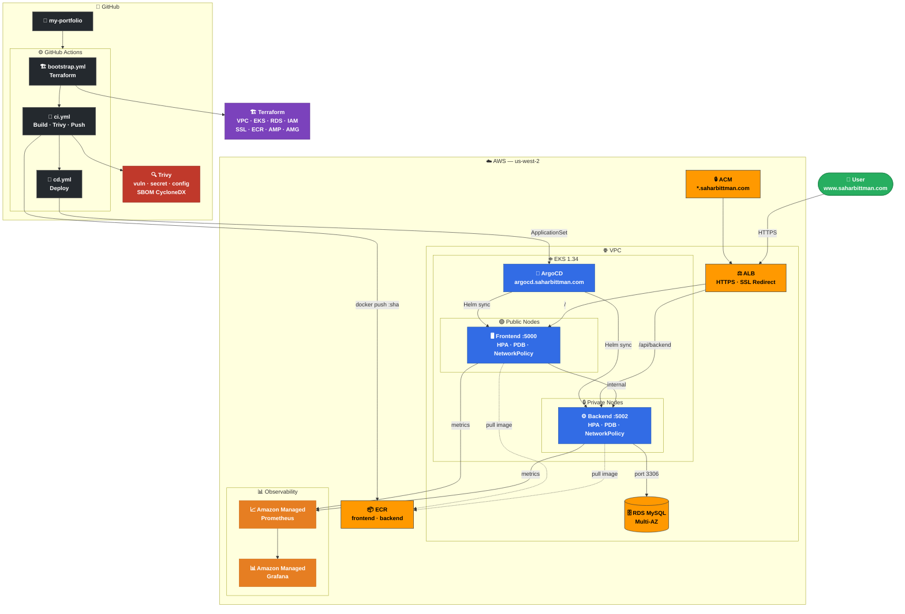
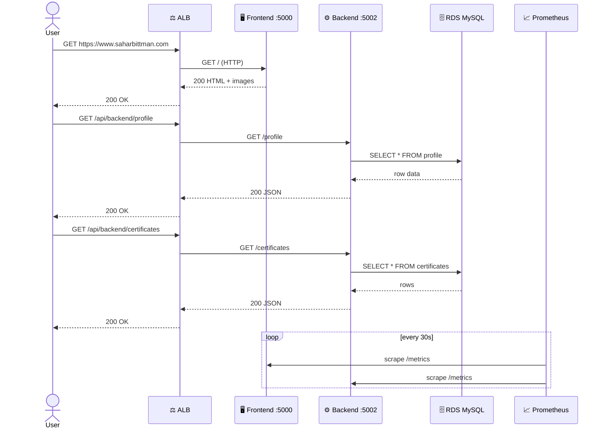

# My Portfolio — DevOps on AWS EKS

Personal portfolio deployed as two Flask microservices on Amazon EKS, with full GitOps via ArgoCD and automated CI/CD through GitHub Actions.

---

## Architecture



---

## Request Trace



---

## Tech Stack

| Layer | Tools |
|-------|-------|
| **Cloud** | AWS EKS 1.34 · RDS MySQL · ECR · ACM · VPC |
| **IaC** | Terraform (VPC · EKS · IAM · RDS · SSL · AMP · AMG) |
| **GitOps** | ArgoCD · ApplicationSet · Helm · sync-waves |
| **CI/CD** | GitHub Actions · matrix builds · OIDC auth |
| **Security** | Trivy · IRSA · Secrets Manager · NetworkPolicy · seccomp |
| **Observability** | Amazon Managed Prometheus · Amazon Managed Grafana |
| **App** | Python Flask · Docker (Alpine) · non-root UID 1000 |

---

## Project Structure

```
.
├── .github/workflows/
│   ├── bootstrap.yml        # Terraform apply/destroy (manual trigger)
│   ├── ci.yml               # Build, Trivy scan, push to ECR, SBOM
│   └── cd.yml               # Trivy scan ArgoCD manifests, deploy
├── ArgoCD/
│   ├── applicationset.yaml  # Deploys both services via sync-waves
│   ├── frontend/helm_chart/ # Deployment, Service, Ingress, HPA, PDB, NetworkPolicy
│   └── backend/helm_chart/  # Deployment, Service, HPA, PDB, NetworkPolicy
├── infra/
│   ├── main.tf
│   └── modules/
│       ├── vpc/             # VPC, subnets, NAT, IGW
│       ├── eks/             # EKS cluster + 10 managed addons + ArgoCD
│       ├── iam/             # IRSA roles (ALB, external-dns, secrets)
│       ├── ecr/             # Container registries
│       ├── rds/             # MySQL Multi-AZ
│       ├── ssl/             # ACM wildcard certificate
│       └── monitoring/      # AMP + AMG workspaces
└── services/
    ├── frontend/            # Flask :5000 — HTML + images
    └── backend/             # Flask :5002 — profile + certificates from RDS
```

---

## CI/CD Pipeline

```
 bootstrap.yml        ci.yml                   cd.yml
 (manual)             (auto after bootstrap)   (auto after CI)
┌─────────────┐      ┌──────────────────────┐  ┌─────────────────────┐
│ Trivy IaC   │      │ Trivy fs scan        │  │ Trivy ArgoCD scan   │
│ scan infra/ │ ───► │ Build & push to ECR  │  │ Deploy ApplicationSet│
│             │      │ Trivy image scan     │  │ Smoke test          │
│ terraform   │      │ Generate SBOM        │  │                     │
│ apply       │      │ Smoke test container │  │                     │
└─────────────┘      └──────────────────────┘  └─────────────────────┘
```

### bootstrap.yml — Terraform
- Trivy IaC scan (`config + secret`) on `infra/`
- `terraform apply` → VPC, EKS, RDS, IAM, SSL, ECR, AMP, AMG, ArgoCD addon
- Auto-destroys on apply failure

### ci.yml — Build & Test
| Step | Details |
|------|---------|
| Trivy filesystem | `vuln + secret + config` on source code |
| Build & push | Docker image tagged with commit SHA pushed to ECR |
| Trivy image | `vuln + secret + config` on the built image |
| SBOM | CycloneDX format uploaded as artifact |
| Smoke test | Container started locally, `/health` endpoint verified |

### cd.yml — Deploy
| Step | Details |
|------|---------|
| Trivy scan | `config + secret` on `ArgoCD/` manifests |
| aws-auth | Grants IAM user cluster access |
| ApplicationSet | `envsubst` injects ECR URLs → `kubectl apply` |
| Smoke test | Polls `https://www.saharbittman.com/health` |

**Destroy path** (manual): deletes ArgoCD apps → waits for ALB cleanup → `terraform destroy`

---

## Security

| Control | Details |
|---------|---------|
| **Non-root** | All pods run as UID 1000 (`appuser`), `allowPrivilegeEscalation: false` |
| **Capabilities** | `capabilities.drop: ALL` on every container |
| **Seccomp** | `RuntimeDefault` profile on every pod |
| **IRSA** | Least-privilege IAM per service account (no node-level permissions) |
| **Secrets** | RDS credentials via AWS Secrets Manager + secrets-store-csi |
| **NetworkPolicy** | Backend reachable only from frontend pods; port 3306 only from backend |
| **Node isolation** | Frontend on public nodes, backend on private nodes (no internet) |
| **Trivy** | Scans source, Dockerfile, image, IaC, and ArgoCD manifests at every stage |

---

## Infrastructure Modules

| Module | Resources |
|--------|----------|
| `vpc` | VPC, public/private subnets across 2 AZs, NAT gateway, IGW |
| `eks` | EKS 1.34, 2 node groups (public/private), 10 managed addons + ArgoCD |
| `iam` | IRSA roles — ALB controller, external-dns, EBS CSI, secrets |
| `ecr` | ECR repositories for frontend and backend |
| `rds` | MySQL Multi-AZ, subnet group, security group |
| `ssl` | ACM wildcard certificate (`*.saharbittman.com`) with DNS validation |
| `monitoring` | AMP workspace + AMG workspace |

---

## Quick Start

```bash
# 1. Fork the repo and set GitHub Secrets:
#    AWS_ROLE_TO_ASSUME · AWS_ACCOUNT_NUMBER · AWS_USER · DB_PASS

# 2. Run Bootstrap (GitHub Actions UI)
#    Actions → Bootstrap Infra → Run workflow → apply

# 3. CI runs automatically after bootstrap
#    Builds, scans, and pushes images to ECR

# 4. CD runs automatically after CI
#    Deploys ApplicationSet to ArgoCD

# 5. App:    https://www.saharbittman.com
#    ArgoCD: https://argocd.saharbittman.com
```

## Cleanup

Run CD workflow → `destroy`, then Bootstrap → `destroy`.

---

**Sahar Bittman** — [github.com/sahar449](https://github.com/sahar449)
